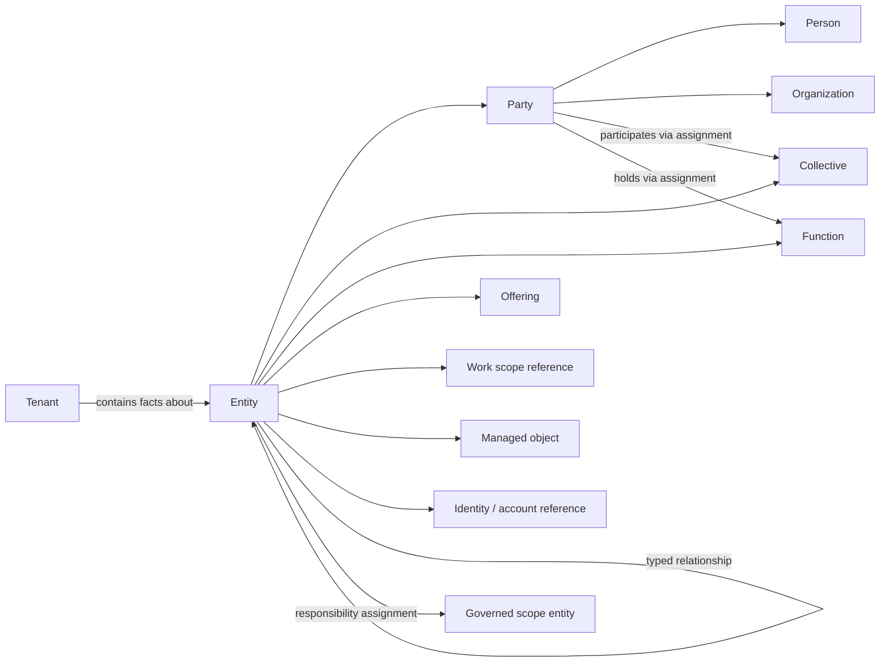

# Company Structure & Ontology — Component Charter

Status: **Draft 0.2 for discovery review**

Scope: architecture and product boundaries; no implementation commitment

Intended readers: product, domain stakeholders, security/privacy, platform, and engineering

## 1. Charter

### Business purpose

The Company Structure & Ontology component provides a tenant-scoped, machine-readable account of **who and what exists in an organizational context, how those things relate, and when those facts are valid**.

It is the organizing backbone for:

- locating knowledge and process ownership;
- resolving organizational context for people and downstream services;
- expressing responsibility, stewardship, and escalation paths;
- supplying trustworthy structural attributes to downstream policy decisions;
- connecting business concepts to systems and managed assets; and
- supporting auditable organizational change without assuming one fixed company shape.

The component is successful when a tenant can describe a small product company, a public-purpose institution, or a multi-organization governance setting without code changes, while tenant isolation, provenance, minimization, and lifecycle controls remain enforceable.

### Product promise

Given a tenant, a permitted actor, a purpose, and a point in time, the component can answer bounded questions such as:

- How are Team Danmark's executive leadership, seven specialist areas, and supporting functions related without forcing all of them into one department hierarchy?
- Which people hold a specialist function as well as a coordinating or professional-lead function, and during which periods?
- Which people participate in a governing body, who appointed them where applicable, and which seat, capacity, and term does each appointment concern?
- How are Pingo Documents' legal organization, founders, employees, consultants, contributor network, products, customer groups, and supplier relationships represented separately but connected?
- Which organization offers a product or service, which organizations use or partner around it, and who is responsible for that relationship?
- In a BOARD OFFICE-style setting, which person participates in which board or governing body, possibly across several organizations, and in what capacity?
- Which external adviser—such as an auditor, lawyer, or bank—is associated with a governing body or organization, without treating that association as an access grant?
- Why is any of these facts believed to be true, where did it come from, and when was it valid?

These questions are informed by the public [Team Danmark organization](https://www.teamdanmark.dk/om-os/organisation) and [employee directory](https://www.teamdanmark.dk/om-os/medarbejdere), [Pingo Documents company profile](https://www.pingodocs.dk/om-pingo), and [BOARD OFFICE product site](https://www.board-office.dk/), reviewed on 2026-08-29. They are discovery examples, not authoritative imports or endorsements.

It does **not** decide employment law, determine a GDPR lawful basis, or grant access by itself.

## 2. Design principles

1. **Tenant first.** Every fact belongs to exactly one security and governance boundary.
2. **Facts, not assumptions.** Roles, membership, ownership, and reporting lines are explicit, temporal relationships rather than fields inferred from titles or email domains.
3. **People are not accounts.** A human, an application identity, and an external-provider account are distinct things.
4. **Description is not authorization.** Organizational facts may inform a policy engine, but do not directly confer access.
5. **Purpose-limited context.** Consumers receive only the minimum approved projection needed for their declared purpose.
6. **History with correction.** Important facts retain provenance and validity; correction and erasure remain possible.
7. **Stable core, governed extensions.** Common semantics are portable; tenant-specific vocabulary is namespaced and validated.
8. **No database ideology.** An ontology is a semantic contract, not a requirement to use a graph database.

## 3. Terminology

| Term | Meaning in this component |
|---|---|
| Tenant | The primary data-isolation and administration boundary in the platform. It may represent a company, institution, association, group, or another governed workspace; it is not itself an organization type. |
| Entity | Any independently identifiable thing described by the ontology. Entity families provide broad semantics; kinds provide more specific vocabulary. |
| Party | An actor that can participate in relationships. The foundational party kinds are person and organization. |
| Organization | A legally, publicly, or operationally recognized collective actor, such as a company, public institution, association, supplier, customer, or partner. Internal structure is modeled separately. |
| Person | A tenant-local representation of a natural person. Employment, consulting, board service, membership, and customer-contact status are relationships—not person subtypes. A person may exist without platform access. |
| Collective | A named group within or across organizations, such as a department, specialist area, team, governing body, committee, network, or temporary working group. A collective need not fit a strict hierarchy. |
| Governing body | A collective with formal governance duties, membership rules, terms, or appointment mechanisms, such as a board. It is a kind of collective, not a separate person or organization. |
| Function | A reusable description of work, authority, expertise, or participation. Role, position, profession, and responsibility type are function kinds. |
| Role | A reusable function that may be held in a scope, such as director, professional lead, founder, adviser, board chair, or consultant. A role is neither a person nor automatically a permission bundle. |
| Position/seat | A contextual slot in an organization or collective that can be occupied, vacant, shared, or time-limited, such as a directorship or appointed board seat. |
| Assignment | A time-bounded statement connecting a party to a function, position, collective, or work scope, with capacity, appointment source, delegation, or engagement context where relevant. |
| Membership | A time-bounded form of participation in a collective. Membership may carry a role or position but does not have to. |
| Responsibility | A time-bounded accountability or contribution statement over a governed scope. Responsibility is distinct from job title, membership, and access permission. |
| Offering | A product, service, program, or support capability made available by an organization, alone or with partners. |
| Work scope | A bounded subject of activity, such as an engagement, project, case, process, discipline, or initiative. Domain systems may own its detailed record. |
| Managed object | A governed non-party object, such as a digital system, account, resource, dataset, document collection, facility, device, or other asset. More specific modules define subtype semantics. |
| Identity/account reference | A link to an authenticated principal or provider account. It may represent a person or automation but is not interchangeable with either. Credentials remain outside this component. |
| Relationship | A typed, directional where meaningful, temporal, and attributable fact connecting entities. |
| Ownership | A governance relationship. It never implies property rights or authorization unless a separate policy explicitly says so. |
| Source/provenance | Where a fact came from, who or what asserted it, and when it was recorded. |
| Classification | A sensitivity/privacy label used by policy and projection layers. |

Avoid using **user** as a domain synonym for person. Use it only for an authenticated product actor.

## 4. Scope

### In scope for the foundational component

- tenant-local entities and stable identifiers;
- parties, collectives, functions, memberships, positions, and assignments;
- identities and external accounts as references, without storing credentials;
- offerings, work-scope references, and managed objects;
- typed relationships, responsibility/ownership assignments, and bounded hierarchy;
- validity periods, lifecycle state, provenance, source confidence, and audit events;
- tenant-defined vocabulary and attributes through governed extensions;
- query projections for authorized people, policies, and integrations;
- privacy classification, retention hooks, export, correction, and erasure workflows;
- import/reconciliation boundaries for directories, business systems, registries, and inventories.

### Explicitly out of scope

- authentication, credential storage, sessions, and identity-provider operation;
- the final authorization/policy decision point;
- HR payroll, performance, absence, or other full employee-record functions;
- CRM, contract, project-management, CMDB, or asset-inventory workflows in full;
- storage of document bodies, work products, or general knowledge content;
- automated legal classification of controller/processor relationships or lawful basis;
- workflow orchestration and business-process execution;
- a universal cross-tenant directory of natural persons.

Adjacent components keep their own domain records and reference ontology IDs. This component should not become the platform's miscellaneous master-data store.

## 5. Conceptual model

### Model shape

The recommended logical model is a small typed-node/typed-relationship core with explicit assignment entities where the relationship carries business meaning.

This is conceptual. It does not prescribe tables, inheritance, or a graph datastore.

### Core entity families

All records have an opaque ID, `tenant_id`, family/kind, lifecycle state, display label, timestamps, provenance, classification, and version. Personal attributes are optional and minimized. Families remain broad; domain-specific kinds are vocabulary, not new storage silos.

| Family | Purpose | Example kinds |
|---|---|---|
| Party | Represents an actor independently of how it participates | person, organization |
| Collective | Represents a named grouping or body, whether hierarchical, cross-functional, or temporary | unit, team, specialist area, governing body, committee, contributor network |
| Function | Defines reusable organizational meaning independently of its holder | role, position, profession, responsibility type |
| Offering | Represents something an organization makes available to others | product, service, program, support capability |
| Work scope reference | Anchors an assignment or relationship to bounded activity owned here or by another domain | engagement, project, case, process, discipline, initiative |
| Managed object | Represents a non-party object that needs structure, custody, dependency, or responsibility relationships | system, resource, dataset, document collection, location, facility, equipment |
| Identity/account reference | Links a party or automation to an authoritative external principal/account | directory identity, provider account, workload identity |

### First-class relationship/assignment families

Important relationships are records, not unstructured labels. Each carries source, status, `valid_from`, optional `valid_until`, record timestamps, and optional metadata constrained by its type.

| Family | Semantics | Examples |
|---|---|---|
| Structural | Composition or grouping | collective **part of** organization; collective **coordinates with** collective |
| Membership/appointment | Participation in a collective or seat | person **member of** board; authority **appoints** person **to** seat |
| Function assignment | A party holds a function in a scope | person **holds professional-lead role in** specialist area |
| Responsibility assignment | Accountability or contribution for a governed scope | collective **accountable for** offering; person **consulted on** process |
| Ownership/stewardship | Named governance duties | organization **owns** offering; person **steward for** managed object |
| Reporting/escalation | Operational direction | position **reports to** position; matter **escalates to** governing body |
| Inter-party | External participation or exchange | organization **partners with** organization; supplier **provides service to** customer |
| Offering/work | Connects parties, offerings, and bounded activity | organization **offers** product; engagement **serves** customer |
| Object/dependency | Custody, composition, or operational dependency | managed object **part of** managed object; offering **depends on** managed object |
| Identity link | Links parties or automation to external principals/accounts | identity **represents** person; account **issued by** organization |

Relationship type definitions specify allowed endpoint families, direction, cardinality, inverse label, whether cycles are allowed, temporal rules, and sensitivity defaults. Free-text relations are not queryable semantics.

### Why assignments are separate

`Person.role = "Director"` is insufficient. A role can be shared, delegated, vacant, appointed by another party, limited to a collective or work scope, and changed over time. A role assignment therefore links:

- subject: party or, where explicitly allowed, automation identity;
- function and optional position/seat;
- scope: tenant, organization, collective, offering, work scope, or managed object;
- validity and lifecycle;
- optional capacity, appointment source, delegation, and engagement details; and
- source and approval provenance.

Responsibility uses the same pattern but describes accountability rather than job function. An optional RACI vocabulary can be added later; it is not embedded in the core.

The same model supports small companies, public-purpose institutions, associations, matrix organizations, governing bodies, professional networks, outsourced roles, product portfolios, and temporary teams without redefining people by their current relationship to the organization.

## 6. Extensibility and semantic governance

Use three levels of vocabulary:

1. **Core types** are platform-owned, versioned, and portable across tenants.
2. **Approved modules** add shared vocabularies, such as governance bodies, provider resources, delivery engagements, or RACI responsibility kinds.
3. **Tenant extensions** add namespaced entity kinds, relationship types, attributes, and labels under tenant governance.

Extension rules:

- extensions must declare a namespace, owner, version, schema, classification, and compatibility policy;
- core meanings cannot be redefined by tenant extensions;
- custom relationship types declare endpoints and validation constraints;
- labels may be localized without changing stable semantic identifiers;
- promoted concepts require migration and deprecation rules;
- arbitrary JSON may carry non-critical annotations, but cannot replace core fields or authorization-critical semantics;
- schema and vocabulary changes are audited and testable against tenant data before activation.

Start with a pragmatic application ontology. Formal RDF/OWL export or alignment with external standards is a later interoperability decision, not a prerequisite.

## 7. Multi-tenancy and isolation

### Boundary rules

- Every entity, relationship, assignment, vocabulary extension, search index entry, audit event, and cache entry is tenant-bound.
- Every read and write is evaluated in an authenticated tenant context; callers cannot supply an unchecked tenant identifier to broaden scope.
- IDs are opaque and globally collision-resistant, but possession of an ID grants no visibility.
- Database constraints and automated isolation tests back application-layer checks.
- Logs, analytics, embeddings, search, backups, exports, and queues preserve tenant partitioning.
- Platform support access is just-in-time, least-privilege, justified, time-limited, and auditable.

### Cross-tenant relationships

A service-provider tenant may represent a customer as an external organization while that customer also has its own platform tenant. These are separate records by default.

Cross-tenant sharing requires an explicit, revocable **link agreement** that defines parties, purpose, approved projections, direction, expiry, and audit ownership. It creates references or controlled projections, not implicit access to the other tenant's graph. A global person profile or automatic matching by email is prohibited by default.

The platform provider control plane is separate from tenant data planes. Provider operations must not masquerade as an ordinary tenant relationship.

Physical database topology—shared database with row-level controls, schemas, or dedicated databases—is deferred until threat modelling and scale requirements are known. The logical isolation contract applies to every option.

## 8. Identity and authority

- A `Person` is a domain subject; an `Identity` is a principal; an external `Account` is a provider object.
- A person may link to zero, one, or many identities/accounts, and an identity may represent a workload rather than a person.
- External identifiers are namespaced by issuer and tenant, treated as sensitive, and never used as public IDs.
- Credentials, tokens, secrets, password hashes, and recovery data remain in identity/security systems.
- Identity links have verification status, source, validity, and unlink history.
- Source systems have declared authority by field or relationship type. For example, HR may be authoritative for employment status while a delivery system owns project membership.
- Conflicts create a reconciliation state; lower-authority imports do not silently overwrite curated facts.
- Service principals and other automation are modeled as workload identities, not fake people.

Organizational attributes are inputs to authorization policy. Access is granted only by the authorization component using explicit policies, authenticated principals, tenant context, purpose, resource, and current facts. Cached policy attributes must have bounded staleness and revocation behavior.

## 9. Lifecycle, time, and provenance

### Suggested lifecycle

`draft → active → suspended → archived`, with `merged` and `erased` as terminal handling states where applicable.

- **Draft:** incomplete and unavailable to ordinary consumers.
- **Active:** valid for approved consumption.
- **Suspended:** temporarily excluded from operational use without losing history.
- **Archived:** no longer current; retained only under policy.
- **Merged:** replaced by another tenant-local record with traceability.
- **Erased:** personal content removed; a minimal non-identifying tombstone may remain only when justified.

Lifecycle state and real-world validity are separate. A future role assignment can be active as a record but valid starting next month.

### Temporal/provenance requirements

- Store effective validity (`valid_from`, optional `valid_until`) on relationships and assignments.
- Store record time and actor/source for creation, change, approval, import, merge, and deletion.
- Preserve append-only audit events separately from mutable current projections.
- Allow correction of inaccurate data while retaining only the audit detail that is lawful and necessary.
- Do not promise full bitemporal querying in the first prototype; retain enough events to evaluate the need.
- Import operations are idempotent and carry source keys, observed time, and reconciliation outcome.

## 10. GDPR and privacy by design

This architecture helps tenants and the platform operator implement controls; it does not itself establish GDPR compliance. Controller, joint-controller, processor, and subprocessor roles are determined **per processing context and contract**, not hard-coded from “tenant” or “platform provider.” Legal/privacy review is required before production.

The design follows the GDPR principles of lawfulness/fairness/transparency, purpose limitation, data minimization, accuracy, storage limitation, integrity/confidentiality, and accountability. It also treats data protection by design and by default as a lifecycle obligation, consistent with [GDPR Articles 5 and 25](https://eur-lex.europa.eu/legal-content/EN/TXT/?toc=OJ%3AL%3A2016%3A119%3ATOC&uri=uriserv%3AOJ.L_.2016.119.01.0001.01.ENG) and the [EDPB Article 25 guidelines](https://www.edpb.europa.eu/documents/guideline/guidelines-42019-on-article-25-data-protection-by-design-and-by-default_en).

### Required privacy controls

- Maintain a processing-purpose catalog and link ontology uses to approved purposes and processing records.
- Record the determined lawful basis outside the ontology schema and require it before enabling each personal-data use.
- Collect the minimum attributes needed; job function and contact route are usually preferable to biography or free text.
- Prohibit special-category data and criminal-offence data in the foundational component by default.
- Classify fields and relationships; relationship facts can themselves be sensitive.
- Provide subject access/export, rectification, restriction, objection-handling hooks, and erasure workflows across current data, indexes, caches, derived projections, and downstream consumers.
- Define retention by purpose and record category. “Soft delete forever” is not an erasure strategy.
- Separate operational audit from employee monitoring; restrict audit access and retention.
- Encrypt in transit and at rest, minimize log payloads, and prevent personal data in metrics and error traces.
- Document subprocessors, data locations/transfers, backup deletion behavior, and breach-response dependencies.
- Perform a DPIA screening before pilots involving systematic employee evaluation, broad relationship inference, or consequential automated decisions; complete a DPIA where required.
- Support transparent notices and a human challenge/correction path for inferred or imported facts.

## 11. Dependencies and integration contracts

| Dependency | What this component needs | What it provides |
|---|---|---|
| Tenant/platform control plane | tenant status, region/policy envelope | tenant-scoped model health and schema version |
| Authentication/identity | authenticated principal and issuer | verified links to tenant-local subjects |
| Authorization/policy | policy decisions and obligations | current, purpose-filtered organizational attributes |
| Privacy governance | purposes, processing records, retention, legal-role decisions | inventory/classification metadata, subject lookup, deletion evidence |
| Audit/security monitoring | immutable event sink and alerting | security-relevant model changes without excessive payloads |
| Connectors/import | source identity, authority rules, cursor/change events | reconciliation outcome and tenant-local IDs |
| Knowledge/process catalog | governed external IDs | party, collective, function, offering, work-scope, and managed-object references |
| Search/indexing | tenant-safe indexing contract | authorized, deletion-aware projections |

Integrations use stable IDs and versioned contracts. They must tolerate archived references and cannot duplicate personal data merely for convenience.

## 12. Quality attributes and invariants

The schema/API stages must make these testable:

- no record or derived artifact exists without a tenant boundary;
- no cross-tenant traversal occurs without an active link agreement and policy decision;
- a person is never required to have an account, and an account is never assumed to be a person;
- authorization-critical facts have typed semantics, provenance, lifecycle, and validity;
- hierarchy types define cycle policy and maximum traversal behavior;
- deletion/rectification propagates to declared downstream projections;
- imports are repeatable and conflicts are observable;
- queries are bounded by tenant, authorization, purpose, and pagination;
- stale facts can be identified by source and observation time;
- every mutation is attributable to a principal or named system source.

Performance targets, availability objectives, recovery objectives, and maximum graph depth are discovery outputs, not guessed here.

## 13. Assumptions to validate

1. One operating organization will often map to one tenant, but groups, subsidiaries, institutions, and shared-service arrangements may require multiple organizations within a tenant or multiple linked tenants.
2. A tenant may need tenant-local representations of external customers, suppliers, partners, advisers, or contacts before those parties have their own tenant.
3. Identity directories and business systems will be important sources but not universal sources of truth.
4. Most authorization decisions need current assignments; historical reconstruction is mainly for audit and explanation.
5. Downstream consumers need small authorized projections, not unrestricted graph traversal.
6. English core vocabulary is acceptable initially, with stable identifiers designed for later localization.
7. Tenant administrators can govern custom vocabulary, subject to platform security/privacy constraints.
8. Data residency, retention, and controller/processor terms may differ by customer and must be policy inputs.

## 14. Principal risks and mitigations

| Risk | Consequence | Early mitigation |
|---|---|---|
| Ontology becomes an unbounded “digital twin” | long discovery, unclear ownership, excessive personal data | enforce scope and use-case admission criteria |
| Flexible extensions destroy interoperability | every tenant becomes bespoke | namespaced schemas, constraints, promotion/deprecation governance |
| Organizational role is mistaken for permission | privilege escalation | separate policy engine; test deny-by-default boundaries |
| Cross-tenant identity matching leaks data | confidentiality and GDPR harm | tenant-local people; explicit link agreements; no email-based global merge |
| Imported data overwrites curated truth | inaccuracy and loss of trust | field-level authority and visible reconciliation |
| History conflicts with erasure rights | unlawful retention | purpose-based retention, redactable events, minimal tombstones |
| Relationship graphs enable employee surveillance | fairness, trust, legal risk | prohibit inferred performance/behavior graphs; purpose review and DPIA screening |
| Deep/cyclic relationships cause unsafe or expensive queries | outages or over-broad context | typed cycle rules, bounded traversal, quotas, pagination |
| Provider support crosses tenant boundaries | insider/data isolation risk | separate control plane and JIT audited access |
| Premature graph-database choice | operational complexity without benefit | prove access patterns before datastore selection |

## 15. Decision record for review

These are proposed defaults, not silently final decisions.

| ID | Proposed decision | Status / evidence needed |
|---|---|---|
| D-01 | Tenant is the mandatory logical isolation boundary for every fact and derivative. | **Recommend accept**; security invariant. |
| D-02 | Person records and identity/account references are distinct concepts. | **Recommend accept**; necessary for correctness and minimization. |
| D-03 | Functions, memberships, appointments, and responsibilities use scoped, temporal assignments. | **Recommend accept**; validate with reference scenarios. |
| D-04 | Organizational facts inform but never directly grant authorization. | **Recommend accept**; security invariant. |
| D-05 | Cross-tenant data is shared only through explicit, revocable projections/link agreements. | **Recommend accept**; validate collaboration UX. |
| D-06 | Use a typed relationship model with relational implementation as the initial baseline; no graph database commitment. | **Pending** access-pattern spike. |
| D-07 | Core + approved modules + governed tenant namespaces form the extension model. | **Pending** customization workshop. |
| D-08 | Retain validity plus audit events initially; defer full bitemporal query support. | **Pending** audit/history scenarios. |
| D-09 | Special-category and criminal-offence data are prohibited by default. | **Recommend accept**; privacy/security review. |
| D-10 | Formal RDF/OWL compatibility is optional and deferred. | **Pending** interoperability requirements. |

## 16. Staged route and review gates

Each stage produces one small artifact set. Do not begin the next build stage until its gate is reviewed.

### Stage 0 — Charter alignment

Deliverable: this charter, reviewed comments, named domain owner, privacy owner, and security owner.

Gate: scope, terminology, invariants, and proposed decisions are accepted or explicitly revised.

### Stage 1 — Discovery slices

Deliverables:

- 8–12 concrete scenarios, including joiner/mover/leaver, board appointment expiry, dual specialist/lead roles, external advisers, partner/supplier relationships, and delegated responsibility;
- source-of-truth matrix by field/relationship;
- data-purpose/minimization worksheet and DPIA screening;
- sample tenant boundary and cross-tenant sharing stories.

Gate: each proposed concept is justified by at least one approved use case; unnecessary personal fields are removed.

### Stage 2 — Conceptual schema

Deliverables:

- versioned entity/relationship vocabulary;
- cardinality, hierarchy/cycle, lifecycle, provenance, and extension rules;
- 2–3 representative example datasets: public-purpose institution, small product company, and multi-board/adviser setting;
- open decision log and glossary diff.

Gate: domain, privacy, and security walkthroughs can answer the discovery questions without implementation-specific workarounds.

### Stage 3 — Contract/API design

Deliverables:

- resource/query/command contracts and error model;
- tenant-context, authorization, purpose, pagination, idempotency, concurrency, and versioning rules;
- minimal event/import and deletion-propagation contracts;
- threat model and abuse cases.

Gate: contracts demonstrate deny-by-default isolation, safe evolution, and subject-rights workflows.

### Stage 4 — Thin prototype

Deliverables:

- one tenant-local vertical slice for party/collective/function assignment/offering/managed object;
- one directory or business-system import stub or fixture;
- one policy-filtered human view and one authorized consumer projection;
- observable audit and reconciliation path.

Gate: the designated pilot dataset works end to end; no production data or unreviewed automated writes.

### Stage 5 — Verification

Deliverables:

- invariant, schema, lifecycle, temporal, concurrency, import, and migration tests;
- adversarial tenant-isolation and authorization tests;
- erasure/rectification/index/cache propagation tests;
- performance spike using measured traversal/query patterns;
- usability review for correction and provenance.

Gate: security/privacy sign-off on evidence, not only design; datastore topology decision recorded.

### Stage 6 — Controlled pilot

Deliverables:

- agency as first tenant with synthetic data followed by approved minimized real data;
- runbooks for onboarding, reconciliation, access review, incident response, export, correction, and erasure;
- monitoring, backup/restore test, retention jobs, support-access controls, and rollback plan;
- tenant administrator guidance and transparent employee notice where applicable.

Gate: operational readiness review and time-boxed pilot acceptance criteria pass.

### Stage 7 — Production and evolution

Deliverables:

- production SLOs and ownership;
- versioned migration/deprecation process;
- recurring access, retention, extension, and privacy reviews;
- evidence pack for customer assurance and processor/subprocessor obligations;
- measured roadmap for additional modules and interoperability.

Gate: production approval, followed by scheduled re-evaluation as uses, risks, sources, and technology change.

## 17. First discovery review agenda

Keep the first review to 60–90 minutes and decide only what unlocks Stage 1:

1. Confirm the component's boundary and name a domain owner.
2. Walk through three reference cases: Team Danmark's governance/specialist structure, Pingo's mixed roles/product relationships, and BOARD OFFICE's multi-board/adviser relationships.
3. Challenge the person/identity/account and role/responsibility distinctions.
4. Identify sensitive relationships and prohibited fields.
5. Select the first 8–12 scenarios and their source-system owners.
6. Accept or amend D-01 through D-05 and D-09; leave technology choices pending.

The immediate next artifact should be the discovery scenario pack, not a database schema.
