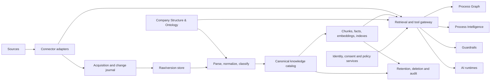

# Knowledge Data & Connectors — Component Charter

**Status:** Architecture discussion draft  
**Scope:** Empty-box definition; no connector or ingestion implementation  
**Upstream dependency:** Company Structure & Ontology  
**Primary consumers:** Process Graph, Process Intelligence, Guardrails, and authorized AI runtimes

## 1. Purpose

Knowledge Data & Connectors (KDC) is the governed knowledge plane of a GDPR-compliant, multi-tenant AI process platform. It acquires or accesses customer information, classifies and normalizes it, preserves its provenance and business context, and makes it available to AI systems under the same ownership, purpose, permission, retention, and tenant boundaries that apply at the source.

The component must answer five questions for every item or live result:

1. **Whose data is this?** Tenant, legal entity, organizational unit, owner, steward, and source authority.
2. **What is it?** Source type, content type, semantic type, language, sensitivity, and lifecycle state.
3. **Why may it be processed?** Declared purpose, lawful basis, allowed use, retention rule, and policy version.
4. **Who may use it now?** Source permissions plus platform policy, evaluated at retrieval or tool-call time.
5. **Where did this answer come from?** Immutable provenance from the delivered evidence back to the source object and version.

The agency is the first test tenant, but its configuration must use the same tenant contracts and isolation boundaries as any customer. It must not become a privileged implicit “system tenant.”

## 2. Boundary and responsibilities

### In scope

- Registering source systems and their accountable owners.
- Connector capability discovery, authorization, health, and lifecycle management.
- Snapshot ingestion, change synchronization, and live query/tool access.
- Malware/type validation, extraction, parsing, normalization, and enrichment.
- Classification, data-subject and sensitivity signals, and policy labels.
- Structural linking to the Company Structure & Ontology component.
- Versioned canonical records, derivatives, chunks, indexes, and provenance.
- Deletion, legal hold, retention, reprocessing, and source reconciliation.
- Retrieval-time tenant, identity, purpose, policy, and source-permission enforcement.
- Evidence delivery to authorized AI and process components.
- Quality measurement, evaluation datasets, audit events, and operational metrics.

### Out of scope

- Defining the canonical company/org ontology itself.
- Acting as the identity provider or master policy-authoring system.
- Executing business processes or deciding their next steps.
- Training foundation models.
- Generating final user answers without an AI/runtime consumer.
- Silently becoming the master copy of source-system content.

KDC may cache and normalize source content, but source authority must always be explicit. For derived-only platform knowledge, KDC can be the source authority if the item is registered as platform-authored and given an accountable owner.

## 3. Architectural principles and invariants

1. **Tenant is a mandatory partition key.** Every persisted object, job, cache key, index entry, event, log reference, and cryptographic context carries `tenant_id`.
2. **Structure precedes availability.** An item is not generally retrievable until it is linked to at least one valid structural scope and has an owner, purpose, and policy state. An explicit quarantine route handles exceptions.
3. **Authorization is evaluated late.** Index membership is not authorization. Access is re-evaluated for the requesting principal, purpose, and current policy before evidence leaves KDC.
4. **Provenance is immutable and derivatives are reproducible.** Each chunk, embedding, summary, or extracted fact points to the exact source version, transform versions, and timestamps that produced it.
5. **Source truth and derived truth are distinct.** Raw/source snapshots, canonical representations, and derived artifacts have separate identities and lifecycle rules.
6. **Deletion propagates.** A deletion or restriction affects source snapshots, canonical records, chunks, embeddings, caches, evaluation copies, exports, and downstream notifications.
7. **Purpose limitation is machine-enforceable.** “Internal AI” is not a sufficient purpose. Retrieval requests state a registered purpose and processing context.
8. **No cross-tenant learning by accident.** Tenant content, prompts, feedback, embeddings, and evaluation traces are not reused across tenants unless a separate, explicit, lawful, auditable agreement permits it.
9. **Connector least privilege.** Prefer delegated/user-bound access when the use case needs user-equivalent permissions; constrain application access to approved sites, folders, schemas, or APIs.
10. **Fail closed on uncertainty.** Missing tenant context, unresolved identity, stale ACL state beyond policy tolerance, invalid structural links, or policy service failure prevents delivery.

## 4. Relationship to Company Structure & Ontology

Company Structure & Ontology is the organizing foundation; KDC owns knowledge artifacts and references the foundation by stable identifiers. KDC must not copy organizational names as its only relationship, because names and reporting structures change.

The minimum upstream contract is:

| Upstream entity | Examples | KDC use |
|---|---|---|
| Tenant and legal entity | agency, customer company, subsidiary | isolation, controller/processor role, residency and policy scope |
| Organizational node | business unit, department, team, location | ownership, visibility scope, routing and filtering |
| Role and responsibility | process owner, document steward, DPO, subject-matter expert | accountability and access policy inputs |
| Process and capability | sales intake, invoice processing, customer support | purpose binding and downstream process relevance |
| Business object/type | customer, contract, case, invoice, policy | semantic classification and entity links |
| Policy/purpose | service delivery, support, legal obligation | lawful processing and retrieval constraints |
| Vocabulary/taxonomy | document class, confidentiality level, topic | normalization and search facets |

Every structural reference is represented as a version-aware edge:

```text
StructuralLink {
  tenant_id
  knowledge_item_id
  target_type
  target_id
  relationship_type       // owned_by, applies_to, evidence_for, produced_by, about, governed_by
  ontology_version
  valid_from
  valid_to?
  asserted_by             // source rule, classifier, user, steward
  confidence?
  review_status
}
```

Required upstream behavior:

- Stable, non-recycled IDs and tenant-qualified resolution.
- Version/change events for entities, relations, purposes, and policies.
- Validity intervals rather than destructive replacement of historical structure.
- A resolver that says whether a link is active, superseded, merged, or invalid.
- A bootstrap vocabulary sufficient to onboard the agency without hard-coding it in KDC.

If the upstream service is unavailable, KDC may continue already-authorized operations only within a documented freshness window. New or structurally ambiguous material remains quarantined.

## 5. Logical architecture



The architecture has three separable planes:

- **Control plane:** tenant/source registration, credentials, connector scopes, policies, schemas, structural mappings, retention rules, and job configuration.
- **Data plane:** snapshots, normalized items, derivatives, indexes, live results, retrieval, and synchronization.
- **Evidence plane:** lineage, audit events, quality metrics, evaluation results, deletion receipts, and policy decisions.

Physical services may initially be combined, but their contracts and authorization boundaries remain distinct.

## 6. Source taxonomy and acquisition modes

### Source families

| Family | Examples | Characteristic concerns |
|---|---|---|
| File/object stores | uploads, network folders, blob stores | file identity, duplicates, malware, nested archives, moves and deletes |
| Microsoft 365 | SharePoint, OneDrive, Teams-backed files, Outlook where approved | delegated vs application access, inherited permissions, sharing links, sensitivity labels, delta APIs |
| Databases | SQL databases, data warehouses, line-of-business stores | row/column security, CDC, schema drift, query cost, transaction consistency |
| SaaS and APIs | CRM, CMS, ticketing, ERP, custom REST/GraphQL | rate limits, object permissions, webhooks, pagination, API versioning |
| MCP-accessible systems | remote or local MCP servers and tools | tool trust, runtime authorization, result volatility, prompt injection, side effects |
| Communication content | approved mailboxes, chats, transcripts | high personal-data density, participant permissions, thread semantics |
| Platform-authored knowledge | approved procedures, curated FAQs, annotations | editorial workflow, owner, effective dates, supersession |

### Acquisition modes

Each source declares one or more modes; a source family does not force a mode.

- **Snapshot ingestion:** copy approved content and metadata into governed storage.
- **Incremental synchronization:** maintain a local representation from deltas, CDC, webhooks, or polling.
- **Federated retrieval:** query the source at request time without retaining full content.
- **Live tool access:** invoke a read-only or state-changing capability at runtime, commonly through MCP or an API.
- **Event subscription:** receive business or content events and resolve details as needed.
- **Curated submission:** accept reviewed human-authored material through an approval flow.

The selected mode is recorded per source scope and purpose, considering latency, freshness, data minimization, availability, security, cost, and source permission fidelity.

## 7. Connector contract

A connector is an adapter implementing a capability-negotiated contract. Unsupported capabilities must be declared, never simulated.

### Registration descriptor

```text
ConnectorDescriptor {
  connector_type
  implementation_version
  supported_auth_modes
  supported_acquisition_modes
  object_types
  change_detection: delta | webhook | cdc | polling | none
  permission_model: item_acl | container_acl | row_policy | delegated_live | coarse
  deletion_signal: explicit | tombstone | reconciliation | unavailable
  content_limits
  residency_constraints
  rate_limit_model
  side_effect_class: read_only | writes_possible
}
```

### Required operations

| Operation | Contract |
|---|---|
| `testConnection` | Verify identity, scopes, approved boundaries, and clock; return no source content |
| `enumerateScopes` | List only administrator-approved roots/sites/schemas/object types |
| `discoverSchema` | Return types, fields, semantics, sensitivity hints, and schema version |
| `enumerateChanges` | Return ordered upserts, moves, ACL changes, and deletions with resumable cursor |
| `fetchMetadata` | Fetch stable source ID, version, timestamps, owner, ACL, labels, and content descriptor |
| `fetchContent` | Stream content by exact source version with size/hash validation |
| `resolvePermissions` | Resolve source-native effective permissions or declare fidelity limits |
| `executeLive` | Invoke a declared operation with principal, purpose, timeout, and side-effect policy |
| `acknowledge` | Advance a cursor only after durable processing |
| `health` | Report auth expiry, throttling, cursor age, failures, and source lag |

All calls include `tenant_id`, `source_registration_id`, correlation ID, actor/workload identity, purpose ID, and deadline. Mutating tool operations require a separate contract and are not enabled by a read connector registration.

### Connector security

- Credentials live in a secrets manager, referenced by opaque ID and isolated by tenant/environment.
- Tokens are never placed in content stores, prompts, indexes, or general logs.
- Egress is allow-listed; certificates and endpoints are validated.
- Content is treated as hostile input: type sniffing, malware scanning, decompression limits, parser sandboxing, and prompt-injection labeling are required.
- Each installation records the source account, granted scopes, approver, date, expiry, and last review.
- Credential and permission changes generate auditable configuration versions.

## 8. Canonical knowledge model

The catalog separates four identities:

1. **Source object:** identity assigned by the authoritative source.
2. **Source version:** immutable observation of that object at a specific source version/change token.
3. **Knowledge item:** stable platform identity across moves and versions where source identity permits.
4. **Derivative:** reproducible output tied to a source version and transform configuration.

### Minimum metadata envelope

```text
KnowledgeItem {
  tenant_id
  knowledge_item_id
  source_registration_id
  source_object_id
  source_locator             // protected; display-safe locator separate
  source_authority
  item_type
  media_type
  title?
  language[]

  current_source_version_id
  source_created_at?
  source_modified_at?
  observed_at
  content_hash?
  size_bytes?

  owner_refs[]
  steward_refs[]
  structural_links[]
  purpose_ids[]
  lawful_basis_refs[]
  policy_labels[]
  sensitivity_labels[]
  personal_data_categories[]
  data_subject_categories[]
  residency_class?

  source_acl_ref
  platform_policy_ref
  permission_freshness_at

  lifecycle_state           // discovered, quarantined, active, restricted, superseded, deleted
  retention_rule_id
  retention_trigger_at?
  legal_hold_refs[]
  review_status
  quality_state

  metadata_schema_version
  created_at
  updated_at
}
```

Fields containing personal or secret information should themselves be classified. Metadata minimization matters: a filename, URL, owner name, or database key can be personal or confidential even when content is not copied.

## 9. Provenance and lineage

Every delivered evidence unit has a lineage chain:

```text
RetrievalResult
  -> derivative_id / live_result_id
  -> transform_run(s) or live invocation
  -> exact source_version_id or query/tool response
  -> source_object_id + source_registration_id
  -> tenant + structural links + policy decision
```

A `TransformRun` records input IDs and hashes, parser/chunker/classifier/embedding model names and versions, configuration hash, execution time, status, and quality warnings. AI-generated enrichment additionally records prompt/template version and model/provider execution class without logging unnecessary sensitive prompt content.

Live responses receive a short-lived `LiveResult` envelope with invocation ID, source/tool identity, query parameters in protected audit form, actor, purpose, source observation time, policy decision, result hash, and expiry. A live result must not be presented as durable evidence after its validity window without revalidation.

User-facing citations should resolve to a permitted source location or a platform evidence view. Unauthorized users must not learn a hidden item's title, path, excerpt, existence, or denial reason.

## 10. Parsing, normalization, chunking, and indexing

### Processing stages

1. Validate object identity, type, size, hash, and malware status.
2. Preserve the approved raw snapshot or a metadata-only observation according to acquisition policy.
3. Parse structure before flattening: pages, headings, sections, tables, cells, slides, speaker notes, attachments, threads, and database records.
4. Normalize encodings, timestamps, locale, identifiers, and safe text representation without erasing original values.
5. Detect language, document class, sensitivity, personal-data signals, prompt-injection indicators, and extraction quality.
6. Resolve structural links using deterministic mappings first, reviewed classification second.
7. Produce versioned derivatives and indexes only after policy eligibility checks.

### Chunking policy

- Chunk by semantic and native boundaries before token windows.
- Never combine content from different tenants, source versions, ACL scopes, retention classes, or incompatible purposes.
- Preserve headings, table coordinates, page/slide/record location, surrounding context references, and stable ordering.
- Assign each chunk its own effective policy attributes and provenance.
- Version chunking configuration. Re-chunking creates new derivatives; it does not rewrite lineage.
- Treat summaries and extracted facts as claims, not source text, and preserve their supporting spans.

### Index classes

- Keyword/full-text index for exact terms and filters.
- Vector index for semantic retrieval.
- Metadata/facet index for structural, temporal, source, quality, and policy filtering.
- Optional entity/relationship index for ontology-linked facts and claims.
- Optional ephemeral cache for live federated results.

Indexes are disposable derivatives, never systems of record. Tenant partitioning must exist at the physical or cryptographically enforced namespace level, with defense-in-depth tenant filters in every query. Index entries carry compact authorization attributes, but the retrieval gateway remains the final authority.

## 11. Synchronization, versioning, and reconciliation

### Change model

Normalize source changes to an append-only journal:

```text
SourceChange {
  tenant_id
  source_registration_id
  source_event_id?
  cursor_or_sequence
  object_id
  change_type             // create, update, move, metadata, acl, delete, restore
  source_version_token?
  source_event_at?
  observed_at
  payload_ref?
}
```

Processing is idempotent by tenant, source, object, version, and transform configuration. Cursors advance only after durable journal capture. Out-of-order events are tolerated; the source version token and reconciliation decide current state.

### Required synchronization behavior

- Prefer source-native delta/CDC and webhooks; add periodic full or sampled reconciliation.
- Treat ACL and label changes as high-priority invalidation events.
- Detect schema drift and quarantine incompatible records rather than silently dropping fields.
- Track source lag, processing lag, permission lag, error age, and last successful reconciliation.
- Use backoff and dead-letter handling without advancing past unrecorded changes.
- Maintain separate “observed at,” “effective at,” and “processed at” timestamps.

### Version semantics

Source versions are immutable. The knowledge item points to a current eligible version, while historical versions remain only if retention and lawful-purpose rules permit. Superseded material is excluded from default retrieval but remains addressable for authorized historical processes.

## 12. Deletion, restriction, retention, and legal hold

Deletion is an orchestrated, evidenced state transition, not just removal from a catalog row.

Triggers include source deletion, tenant request, data-subject request, retention expiry, consent withdrawal where applicable, contract termination, administrator action, or policy reclassification. The workflow must:

1. Mark the item unavailable immediately and invalidate retrieval caches.
2. Emit downstream restriction/deletion events.
3. Remove or cryptographically render inaccessible snapshots, derivatives, chunks, embeddings, and non-required traces.
4. Remove the item from evaluation corpora and future training/export sets.
5. Reconcile replicas, backups, and search indexes according to documented erasure schedules.
6. Retain only the minimal deletion receipt required for accountability.
7. Verify completion and record exceptions such as legal hold or statutory retention.

A legal hold suspends deletion only for the precise scope and authority stated; it does not make the material generally retrievable. Source restoration creates a new observed version and undergoes policy evaluation again.

Retention rules define event, duration, action, jurisdiction, authority, review owner, and precedence. Conflicts are resolved by the policy service and recorded, not improvised by connector code.

## 13. Retrieval and live-access authorization

All knowledge leaves KDC through a gateway. Consumers do not query raw vector databases or invoke connectors directly.

### Request contract

```text
KnowledgeRequest {
  tenant_id
  principal_id
  principal_type
  delegated_identity_ref?
  purpose_id
  processing_activity_id
  query_or_operation
  requested_sources?
  structural_scope?
  time_scope?
  sensitivity_ceiling?
  result_limit
  freshness_requirement?
  interaction_id
}
```

### Decision rule

An item or live result is deliverable only when all applicable checks allow it:

```text
tenant match
AND source-native effective access
AND platform role/attribute policy
AND registered-purpose compatibility
AND processing-activity allowance
AND structural-scope allowance
AND sensitivity/label constraints
AND lifecycle and retention eligibility
AND permission/policy freshness requirement
AND consumer capability constraints
```

Candidate generation should apply coarse tenant and authorization filters before ranking to reduce leakage and wasted work. The gateway then performs authoritative per-result checks before returning content. Ranking scores, counts, facets, and timing must not reveal inaccessible material.

Delegated live access runs as the user where possible. Application access must apply a platform-maintained principal-to-source entitlement map and must be reviewed more strictly because the source may not enforce the end user's permissions.

### Response contract

```text
KnowledgeResponse {
  request_id
  policy_decision_id
  results[] {
    evidence_id
    knowledge_item_id?       // absent for some ephemeral live results
    source_version_id?
    content_or_structured_data
    citation
    provenance_summary
    structural_links[]
    observed_at
    validity_until?
    quality_signals[]
    permitted_uses[]
  }
  partial_results
  omitted_source_summary     // non-sensitive operational summary only
}
```

## 14. Tenant isolation and platform security

Minimum controls:

- Tenant context originates from trusted authentication, never request text or model output.
- Separate storage/index namespaces per tenant initially; any later shared infrastructure requires enforced row-level isolation, tenant-bound encryption context, and isolation tests.
- Tenant-specific connector credentials and, where justified, tenant-specific encryption keys.
- Tenant-qualified IDs and cache keys; no globally guessable source locators.
- Separate development, test, and production data planes; production content is not copied into tests by default.
- Per-tenant quotas, concurrency limits, audit views, export controls, and deletion workflows.
- Administrative support access is time-bound, approved, logged, and visible to the tenant where contractually appropriate.
- Logs use opaque references and redaction; raw content is disabled by default.
- Automated negative tests attempt cross-tenant retrieval, cache collision, confused-deputy calls, and unauthorized citation resolution.

## 15. GDPR and privacy requirements

The platform role may vary by processing activity; contracts and records must identify controller, joint controller, and processor/subprocessor roles rather than assuming one role for the entire tenant.

KDC must support:

- **Records of processing:** link source registrations and retrieval purposes to processing activities, data categories, data subjects, recipients, transfers, retention, lawful basis, and owners.
- **Data protection by design/default:** source and field minimization, narrow scopes, default-deny sharing, protected metadata, and bounded retention.
- **Transparency and rights:** searchable subject-association signals where proportionate; evidence-preserving workflows for access, rectification, restriction, portability, objection, and erasure.
- **Consent where used:** consent scope and withdrawal propagation; do not use consent when another lawful basis is actually relied upon.
- **Special-category and criminal-offence data:** explicit classification, heightened policy, access, logging, and jurisdiction-specific conditions.
- **International transfers and subprocessors:** provider/region inventory, approved transfer mechanism references, residency controls, and tenant-visible configuration.
- **DPIA support:** data flows, threat model, necessity/proportionality evidence, residual risks, mitigations, and review triggers for new connectors or AI uses.
- **Security and breach response:** evidence needed to assess affected tenants, items, data subjects, time window, recipients, and containment actions.
- **Automated decision safeguards:** flag when knowledge feeds decisions with legal or similarly significant effects and attach required human-review policy.

Prompts, tool arguments, model inputs/outputs, feedback, and traces are processing records too. Their capture, provider use, residency, retention, and access require explicit policy. Provider “no training” settings do not replace lawful-basis, minimization, and transfer analysis.

## 16. Quality measures and evaluation

Quality is measured at source, transformation, retrieval, authorization, and operational levels.

| Dimension | Example measures |
|---|---|
| Coverage | approved objects discovered; eligible objects indexed; unsupported formats |
| Freshness | source/change/permission lag percentiles; stale-result rate |
| Fidelity | parse success; table/structure preservation; metadata agreement with source |
| Link quality | structural-link precision/recall; unresolved and low-confidence link rates |
| Retrieval | recall@k, precision@k, nDCG/MRR, citation correctness, duplicate rate |
| Authorization | false-allow rate (target zero), false-deny rate, stale ACL exposure, cross-tenant leakage tests |
| Provenance | results with complete resolvable lineage; citation/version agreement |
| Lifecycle | deletion propagation time; retention violations; orphan derivative count |
| Reliability | connector success, cursor age, throttling, recovery time, reconciliation drift |
| Privacy | excess-data rate, unclassified personal data, purpose-policy violations, sensitive log findings |

Evaluation must use tenant-owned, purpose-approved datasets or synthetic fixtures. It includes:

- Golden queries with expected evidence, allowed principals, denied principals, and time/version conditions.
- Adversarial content containing prompt injection, misleading instructions, secrets, and poisoned metadata.
- Permission mutation tests: revoke, move, external share, group membership change, and stale-cache behavior.
- Cross-tenant canaries and randomized isolation tests.
- Parser/chunker regression suites for representative Office, PDF, image/OCR, email, HTML, and structured data.
- Deletion and legal-hold drills with downstream verification.
- Human review by source owners for usefulness and by privacy/security owners for proportionality.

Releases require defined thresholds, with authorization failures blocking release irrespective of average retrieval quality.

## 17. Knowledge delivery strategies

No single strategy is the default. Selection occurs per use case, source, risk, freshness, latency, residency, and evidence needs.

| Approach | Best fit | Strengths | Main limitations and controls |
|---|---|---|---|
| Ingested RAG | stable documents and approved records needing semantic search and citations | controllable indexes, low retrieval latency, reproducible evidence | copied data and ACL lag; requires sync, deletion propagation, chunk evaluation, and gateway enforcement |
| Live MCP/tool access | volatile systems, narrow queries, actions, or source-enforced delegated permissions | freshest data, data minimization, native capabilities | availability/latency, prompt injection, tool trust, side effects, variable result reproducibility; use allow-listed schemas and explicit action approval |
| Fine-tuning | stable behavior, format, classification, or domain task patterns | consistent behavior and potentially lower prompt cost | poor fit for frequently changing facts or access-controlled knowledge; training-data rights, deletion feasibility, memorization, isolation, and evaluation are mandatory |
| Local/self-hosted models | strict residency, offline use, predictable infrastructure boundary | deployment control and reduced third-party transfer | operational burden, capability gap, patching, model security, hardware cost; locality does not eliminate GDPR duties |
| Hosted models | general reasoning and rapid capability access | strong capability and managed scale | subprocessor, transfer, retention, telemetry, and contractual controls; send only authorized minimum context |
| Hybrid | mixed stable/volatile sources or tiered sensitivity | route each operation to the appropriate evidence and model path | higher policy and observability complexity; requires one common request, provenance, and authorization envelope |

Fine-tuning should normally contain examples and behavior patterns rather than tenant facts that require live revocation. This is a design heuristic, not a blanket prohibition; exceptions need a documented deletion and isolation strategy.

## 18. Downstream contracts

All downstream components consume tenant-scoped IDs, evidence handles, and policy decisions. They may cache only within the returned validity and permitted-use constraints.

### Process Graph

**KDC provides:**

- Evidence linked to process, role, organization, system, business-object, and policy IDs.
- Version/restriction/deletion events for evidence already attached to graph nodes or edges.
- Source and validity metadata sufficient to distinguish asserted fact, extracted claim, and curated definition.

**Process Graph provides or preserves:**

- `processing_activity_id`, `purpose_id`, actor, tenant, and structural scope on requests.
- Graph references to immutable `evidence_id`/`source_version_id`, not copied ungoverned text.
- Traceability from process step/decision to supporting evidence and policy decision.

KDC does not decide process semantics; Process Graph does not bypass KDC to dereference evidence.

### Process Intelligence

**KDC provides:**

- Governed knowledge/events with event time, observation time, lineage, quality, and allowed analytical uses.
- Aggregation or de-identification options where row-level detail is unnecessary.
- Correction, restriction, and deletion signals that can invalidate metrics and features.

**Process Intelligence provides or preserves:**

- Analysis purpose, population/scope, required fields, time window, and output granularity.
- Dataset/feature lineage back to KDC evidence IDs and policy decision IDs.
- Suppression and re-computation behavior for corrected/deleted inputs.

KDC does not infer employee-performance purposes from operational data. A new analytical purpose requires policy review.

### Guardrails

**KDC provides:**

- Classification and sensitivity labels, provenance, permitted uses, citation requirements, injection-risk signals, and validity windows.
- A policy-check endpoint for evidence use and tool invocation.
- Auditable allow/deny/transform decisions and revocation events.

**Guardrails provides or preserves:**

- Runtime context: model, agent, actor, purpose, destination, requested action, and data-flow class.
- Enforcement outcomes such as block, redact, require citation, require confirmation, or escalate to human.
- Incident and feedback signals tied to interaction, evidence, and policy decision IDs.

Guardrails is the runtime enforcement orchestrator; KDC is authoritative for knowledge provenance and availability. A clear policy-service ownership decision is required to avoid conflicting rule engines.

### Common event envelope

```text
KnowledgeEvent {
  tenant_id
  event_id
  event_type               // available, versioned, restricted, deleted, relinked, policy_changed
  knowledge_item_id
  source_version_id?
  structural_link_refs[]
  effective_at
  emitted_at
  reason_code
  correlation_id
}
```

Delivery is at least once; consumers deduplicate by `tenant_id + event_id`. Deletion and restriction events have priority over enrichment events.

## 19. Narrow prototype route

The prototype proves boundaries and revocation, not connector breadth.

### Stage 0 — decisions and fixtures

- Define minimal tenant, organization, team, role, process, purpose, and policy IDs in the upstream ontology contract.
- Choose one agency process with useful but non-special-category data; a candidate is approved internal delivery procedures supporting a staff Q&A assistant.
- Create synthetic and approved agency fixtures, including two tenants, conflicting ACLs, version changes, deletion, and prompt-injection samples.
- Agree measurable acceptance criteria and a short DPIA/threat-model record.

**Exit:** owner, purpose, lawful basis, source scope, retention, test identities, and prohibited uses are documented.

### Stage 1 — governed file slice

- One read-only source: a narrowly scoped SharePoint document library or local fixture adapter with equivalent metadata.
- Support PDF, DOCX, and plain text only.
- Implement source registration, snapshot/version journal, metadata envelope, structural linking, quarantine, deterministic parsing, keyword retrieval, and full provenance.
- Use tenant-separated stores/indexes for two test tenants.

**Exit:** no item is searchable without tenant, owner, purpose, structural link, and active policy state.

### Stage 2 — authorization and lifecycle

- Add source ACL representation, platform policy evaluation, retrieval gateway, current-permission checks, and authorization test matrix.
- Add updates, moves, ACL changes, deletion, retention expiry, index/cache invalidation, and deletion receipts.
- Demonstrate cross-tenant denial and permission revocation within the agreed service level.

**Exit:** zero false allows in the golden/adversarial suite; deletion and revocation propagate end to end.

### Stage 3 — semantic retrieval and AI answer trial

- Add structure-aware chunks and a tenant-separated vector index.
- Compare keyword, vector, and hybrid retrieval using the same golden queries.
- Connect one AI runtime through the KDC gateway, requiring citations and displaying freshness/quality warnings.
- Record only minimized, policy-approved interaction traces.

**Exit:** agreed retrieval/citation thresholds are met without authorization regression.

### Stage 4 — live-access comparison

- Add one read-only live connector or MCP tool for a volatile dataset.
- Run the same use case through ingested RAG, live access, and a hybrid route.
- Compare freshness, correctness, permissions, latency, availability, data copied, operational cost, and auditability.

**Exit:** an evidence-based strategy decision is made for that use case; it is not generalized automatically to all tenants or sources.

## 20. Prototype acceptance criteria

At minimum, the prototype must demonstrate:

- Two tenants cannot discover or retrieve each other's metadata, chunks, results, citations, or logs.
- A user with access and a user without access receive correct outcomes for the same query.
- Revoking source access makes prior evidence unavailable within the defined permission-lag objective.
- A source update produces a new immutable version and citations resolve to the version used.
- A deletion removes retrievable source and derived content and yields a verifiable receipt.
- Every result has resolvable source, version/live invocation, transforms, structural links, and policy decision.
- Prompt-injection content is labeled and cannot alter connector or gateway policy.
- Source/connector outage returns explicit partial/freshness status and does not silently serve over-stale data.
- Quality dashboards show coverage, freshness, parse failures, unresolved links, retrieval scores, and authorization tests.

## 21. Decisions to resolve before implementation

1. What are the exact stable IDs, version semantics, and event contracts of Company Structure & Ontology?
2. Which service owns purpose/policy decisions, and how are conflicts and availability handled?
3. For the first agency use case, who is controller, what is the precise purpose/lawful basis, and which content is excluded?
4. Is the first Microsoft 365 connection delegated, application-scoped, or a controlled export fixture?
5. What permission-lag and deletion-propagation objectives are acceptable?
6. Which tenant isolation tier is required now, and what evidence would permit later shared infrastructure?
7. What regions, model providers, subprocessors, telemetry, and retention settings are approved?
8. Which content and metadata may be persisted for live MCP/API results, and for how long?
9. What human review is required for structural links, sensitivity classification, and derived claims?
10. What are the first golden queries, denied-query cases, and minimum quality thresholds?

## 22. Recommended first architecture discussion

The first workshop should decide only the Stage 0 boundary:

- one agency process and user group;
- one source scope and acquisition mode;
- upstream ontology entities and relationships needed for it;
- purpose, lawful basis, excluded data, retention, and source permission model;
- two-tenant isolation test and three representative identities;
- deletion/revocation service levels;
- whether the initial comparison needs live MCP access or can wait until the governed RAG slice works.

That produces a narrow, testable foundation while leaving RAG, live access, model location, and future connectors as explicit per-use-case decisions.
