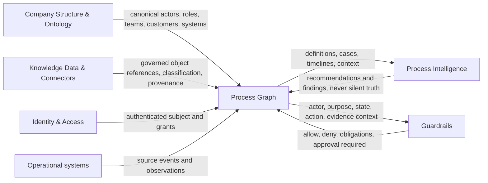

# Process Graph — Component Charter

**Status:** Discussion draft / architecture baseline  
**Scope:** Domain and component architecture; no database or vendor selection  
**Pilot tenant:** The digital agency itself  
**Upstream dependencies:** Company Structure & Ontology; Knowledge Data & Connectors  
**Primary downstream consumers:** Process Intelligence; Guardrails, Governance & Compliance

## 1. Executive position

The Process Graph is the governed representation of how work is intended to happen and how individual items of work actually happen. It connects actors, roles, teams, customers, systems, knowledge, rules, decisions, tasks, states, exceptions, evidence, and outputs without taking ownership of those source domains.

“Graph” describes the connected domain, not a database requirement. The component should expose stable domain identifiers, temporal relationships, versioned process definitions, case histories, and evidence references. The first implementation should favour the simplest persistence model that preserves those semantics. A graph database should be introduced only when measured traversal, discovery, or explainability needs justify its operational cost.

The component is not a workflow engine, document store, identity provider, policy engine, analytics platform, or LLM. It can supply each of those components with process context and accept observations from them.

## 2. Purpose and business outcomes

The component should make work visible, explainable, governable, and improvable across tenant boundaries and heterogeneous tools.

Target outcomes:

- Give a worker a reliable view of a case: current state, owner, completed work, required next steps, applicable rules, evidence, and blockers.
- Let managers compare designed processes with observed work without treating every deviation as failure.
- Let Process Intelligence answer process questions, identify bottlenecks, suggest next actions, and explain those suggestions from traceable facts.
- Let Guardrails decide whether a human or AI actor may view, recommend, approve, or execute an action in the current process context.
- Make customer-facing delivery auditable: who did what, under which process and rule versions, using which inputs, with what decision and output.
- Support controlled process change and impact analysis across roles, systems, knowledge, customers, and active cases.
- Preserve sufficient evidence for quality, security, contractual, and regulatory review while applying minimisation and retention rules.

### Initial use cases

1. **Case overview:** reconstruct the status and history of a customer request or delivery item.
2. **Guided execution:** present the valid next tasks and the knowledge required to perform them.
3. **Handover:** transfer work between people or teams without losing context, responsibility, or evidence.
4. **Conformance:** identify material differences between an approved process and observed execution.
5. **Bottleneck analysis:** find queues, repeated rework, long waits, and avoidable handoffs.
6. **Controlled AI assistance:** assemble only the process and knowledge context allowed for a specific actor, case, purpose, and action.
7. **Audit and explanation:** explain a decision or output using immutable event history and governed references.
8. **Change impact:** identify which roles, systems, rules, knowledge objects, and active cases are affected by a proposed definition change.

### Explicit non-goals for the first release

- General-purpose business process modelling notation coverage.
- Automatic execution of arbitrary end-to-end workflows.
- Employee surveillance or individual productivity scoring.
- Replacing source systems such as Microsoft 365, ticketing, CRM, identity, or document management.
- Using event logs as unquestioned truth; system activity is evidence of activity, not necessarily evidence of business meaning.
- Claiming legal compliance from the existence of a graph or audit log.

## 3. Ubiquitous language

| Term | Working definition | Important distinction |
|---|---|---|
| **Process** | A reusable, governed description of how a business outcome may be achieved, including states, activities, roles, rules, decisions, inputs, outputs, exceptions, and evidence expectations. | A definition/template, not a particular execution. |
| **Case** | One bounded execution of a process for a business subject and purpose, with its own state, participants, timeline, and data references. | The unit of work and history; a case may span several systems. |
| **Task** | A planned or observed unit of work in a case, assigned or assignable to an actor or role, with lifecycle, inputs, outputs, and completion criteria. | A task can be manual, system-performed, or AI-assisted; it is not merely a log event. |
| **Event** | An immutable, time-stamped fact that something relevant occurred or was observed. | Events report facts; they do not themselves encode the current state. Corrections are new events, not rewrites. |
| **State** | A named condition of a case or task at a point in time, derived from accepted events under a specific definition version. | State is a temporal assertion; status labels from source systems may require mapping. |
| **Decision** | A recorded selection among alternatives, made by an authorised human, rule, system, or AI-supported interaction, with rationale and evidence. | A recommendation is not a decision; the accountable decision-maker remains explicit. |
| **Rule** | A governed statement that constrains, validates, routes, or derives an outcome from facts. | The graph references a rule and version; Guardrails or a rule engine evaluates enforceable policy. |
| **Actor** | A participant capable of performing or being accountable for an action: a person, organisational role, team, external party, service account, system, or AI agent. | Actor identity and authority come from Company Structure and identity services. |
| **System** | A governed application, service, platform, account boundary, or technical resource that participates in work or records observations. | The graph references the canonical system record; credentials and configuration live elsewhere. |
| **Input** | Information, material, signal, or prerequisite consumed by a task, decision, or process. | Usually a typed reference to governed knowledge or source data, not a copied payload. |
| **Output** | A result produced by a task, decision, case, or process, including a deliverable, state change, message, or structured record. | An output can become a later input; its provenance remains intact. |
| **Exception** | A material deviation, failure, ambiguity, or condition not handled by the normal path, requiring explicit resolution, waiver, escalation, or process change. | Not every variant is an exception; tolerated variants should be modelled deliberately. |
| **Evidence** | A tamper-evident reference to information supporting that an action, condition, decision, approval, or output existed and met a stated requirement. | Evidence is a reference plus integrity and provenance metadata, not necessarily a duplicate document. |

Additional useful terms:

- **Process definition:** the versioned, reusable design.
- **Process instance:** the runtime history represented by a case and its related tasks, events, decisions, and evidence.
- **Observation:** a claim imported or inferred from a source before or after validation.
- **Conformance finding:** an explainable comparison result between a definition and observed case behaviour.
- **Business subject:** the customer, project, request, contract, incident, document, or other thing the case is about.

## 4. Designed processes and observed instances

Designed and observed models must remain separate but linkable.

### Designed process plane

A process definition has an owner, purpose, applicability, lifecycle status, version, effective period, and change history. It describes allowed or expected behaviour rather than claiming that work occurred. Draft, review, approved, effective, retired, and superseded are useful lifecycle states.

An approved version is immutable. A change creates a new version and an explicit change set. Active cases remain pinned to the version under which they began unless an authorised migration decision moves them. A definition can contain required steps, optional paths, permitted variants, decision points, time expectations, evidence requirements, and exception paths.

### Observed execution plane

A case records what is known about a particular execution. Its event history is append-only. Current state and convenient timelines are projections that can be rebuilt. Each observation records its source, source identifier, observed time, ingestion time, confidence, mapping version, and validation status.

An observed task need not correspond one-to-one with a designed task. Mapping is explicit and can be `confirmed`, `suggested`, `rejected`, or `unmapped`, with confidence and reviewer provenance. This prevents discovery algorithms or LLM classifications from silently rewriting business truth.

### Comparison plane

Conformance is a separate analysis result, not a mutation of either plane. Findings should classify differences such as missing required work, unexpected order, unauthorised actor, late completion, missing evidence, repeated work, or valid exception. A finding must identify the definition version, case history cut-off, algorithm/rule version, evidence, confidence, and review disposition.

## 5. Component boundary and relationships



Ownership rules:

- **Company Structure & Ontology owns** people, roles, teams, organisations, customers, relationships, responsibilities, and canonical system/resource identities.
- **Knowledge Data owns** document/content payloads, classifications, lineage, source synchronization, access metadata, retention, and retrieval.
- **Process Graph owns** process definitions, definition versions, cases, task instances, process-relevant event history, state projections, decision records, exception records, mappings, and evidence requirements/references.
- **Guardrails owns** policy decisions and enforceable obligations. Process Graph supplies context and records the decision reference used for a protected action.
- **Process Intelligence owns** derived insights, recommendations, predictions, and their evaluation. Accepted outcomes return as explicit events or reviewed annotations.

No cross-component link is valid on a naked identifier alone. References include `tenant_id`, resource type, canonical ID, and where meaning depends on time, the referenced version or effective-time assertion.

## 6. Conceptual domain model

The minimal model is a typed, temporal property graph whether or not it is stored in a graph database.

### Definition aggregate

- `ProcessDefinition`: stable identity, tenant, name, purpose, business owner, applicability, sensitivity, lifecycle.
- `ProcessVersion`: immutable version, effective interval, approval, change rationale, definition content hash.
- `ActivityDefinition`: expected work, responsible role(s), preconditions, completion criteria, service expectation.
- `StateDefinition` and `TransitionDefinition`: permitted lifecycle and triggering conditions.
- `DecisionDefinition`: alternatives, accountable role, required rationale/evidence.
- `RuleReference`: canonical rule ID/version and its role in the process.
- `InputRequirement`, `OutputRequirement`, `EvidenceRequirement`, `ExceptionDefinition`.

### Execution aggregate

- `Case`: tenant, business subject, purpose, definition/version, owner, lifecycle, start/end, retention class.
- `TaskInstance`: planned/observed work, actor assignment, lifecycle, timing, definition mapping.
- `ProcessEvent`: immutable fact envelope and typed payload.
- `StateAssertion`: projected or externally asserted state with valid and recorded time.
- `DecisionRecord`: alternatives considered, decision-maker, outcome, rationale, rule/evidence references.
- `ExceptionRecord`: type, severity, detection, owner, resolution/waiver/escalation.
- `EvidenceReference`: knowledge/source locator, content/version hash, classification, collection reason, integrity metadata.
- `OutputReference`: resulting knowledge object, operational record, message, or state change.

### Principal relationships

Examples include `DEFINED_BY_VERSION`, `INSTANCE_OF`, `HAS_TASK`, `PRECEDES`, `DEPENDS_ON`, `PERFORMED_BY`, `ACCOUNTABLE_ROLE`, `ABOUT_SUBJECT`, `USES_SYSTEM`, `CONSUMES`, `PRODUCES`, `GOVERNED_BY_RULE`, `SUPPORTED_BY_EVIDENCE`, `TRIGGERED_BY`, `TRANSITIONS_TO`, `RAISES_EXCEPTION`, `RESOLVES_EXCEPTION`, and `OBSERVED_IN_SOURCE`.

Every relationship should be typed, tenant-scoped, provenance-aware, and temporal where applicable. Avoid a generic `RELATED_TO` edge in governed behaviour; it hides meaning and makes authorization and audit unreliable.

### Invariants

- Every resource belongs to exactly one tenant; cross-tenant collaboration uses explicit, authorised shared-reference records rather than dual ownership.
- Every case identifies a purpose and business subject.
- Every protected mutation has an authenticated actor and authorization decision reference.
- Published definition versions and accepted events are immutable.
- Corrections append superseding assertions; they do not erase audit history unless a lawful privacy operation requires deletion or anonymisation.
- AI-generated mappings, summaries, and recommendations are labelled derived and never become approved definitions or accepted facts without the configured validation path.
- Evidence access is checked at read time against the underlying knowledge object; possessing a process reference does not grant content access.

## 7. Modelling and persistence alternatives

| Alternative | Strengths | Weaknesses | Appropriate use |
|---|---|---|---|
| **Relational domain model** | Strong transactions, constraints, mature tenancy controls, familiar operations, good audit support. | Variable-depth traversal and evolving relationship queries can become awkward. | Recommended system of record for the pilot. |
| **Document model** | Flexible definition documents and rapid schema evolution. | Cross-document integrity, temporal relationships, and traversal are weaker. | Useful for immutable version payloads, not sufficient alone. |
| **Event store + projections** | Natural history, reproducibility, temporal audit, multiple read models. | Requires disciplined event evolution, projection management, and privacy handling. | Recommended pattern for case history, potentially implemented on ordinary relational infrastructure. |
| **Native property graph** | Excellent connected exploration, lineage, impact paths, and variable-depth traversal. | Added operational skills/cost; tenancy, transactions, erasure, and event history still need careful design. | Add as a derived read model if proven by workload. |
| **RDF/semantic graph** | Formal semantics, interoperability, ontology reasoning. | Higher modelling/query learning curve and governance overhead. | Consider only if standards-based exchange or semantic inference becomes a core requirement. |
| **Process-specific workflow/mining suite** | Fast BPMN execution or mining capabilities. | Vendor model may become the architecture; integration, tenancy, and AI context constraints may be limiting. | Evaluate for build-vs-buy after pilot requirements are measured. |

### Recommendation

Begin with:

1. A technology-neutral canonical domain and JSON event contract.
2. A relational system of record for definitions, cases, references, and authorization-friendly queries.
3. An append-only event journal with rebuildable state and timeline projections.
4. Optional definition documents for complex flow structure.
5. Analytics and graph projections that are disposable and reproducible from authorised source data.

A native graph database is justified only if representative tests show that important user journeys require multi-hop, dynamically shaped traversal that is materially simpler or faster than relational projections. Candidate workloads are impact analysis, organisational/process lineage, path comparison across many case variants, and evidence-chain exploration. Before adoption, benchmark query latency, development complexity, tenant isolation, backup/restore, regional deployment, erasure propagation, operational skills, and total cost. The graph must not become an uncontrolled second source of truth.

## 8. Discovery, import, and human validation

Process discovery should combine declared knowledge with observed evidence.

### Sources

- Interviews and workshops with process owner, performers, approvers, and support roles.
- Existing SOPs, checklists, contracts, templates, and quality policies from Knowledge Data.
- Operational events from ticketing, CRM, Microsoft 365, source control, deployment, monitoring, finance, and communication systems.
- Existing BPMN, flowcharts, spreadsheets, and workflow-tool exports.
- Structured observation of a small number of recent cases.

### Discovery pipeline

1. **Register source:** purpose, owner, tenant, lawful basis/context, scope, classification, retention, and access.
2. **Collect minimally:** prefer business events and metadata over message bodies or complete documents.
3. **Normalize:** map source events into a source-neutral observation envelope without discarding the original locator.
4. **Correlate:** associate observations to candidate cases using deterministic keys first; probabilistic/LLM assistance is labelled with confidence.
5. **Infer candidates:** propose activities, sequence variants, roles, waits, decisions, and exceptions.
6. **Validate:** process participants review concrete case timelines; the accountable process owner approves the reusable definition.
7. **Publish:** freeze an approved version with rationale, evidence, and effective date.
8. **Monitor drift:** generate reviewable findings when observed behaviour materially diverges.

### Validation controls

- Show the raw source reference and mapping explanation beside each inferred fact.
- Permit accept, reject, edit, and “insufficient evidence” outcomes.
- Record reviewer identity, role, timestamp, rationale, and reviewed input version.
- Sample normal, exceptional, and failed cases; do not infer the process from only successful examples.
- Separate “commonly happens” from “should happen.” Frequency does not establish policy.
- Require business-owner approval and, where sensitive monitoring is involved, privacy/security and worker-representation review as applicable.

## 9. Lifecycle, ownership, and change control

Each process has:

- an accountable business owner;
- an operational steward/editor;
- consulted role, knowledge, system, privacy, security, and compliance owners;
- an approval policy proportionate to sensitivity;
- a review interval and retirement criteria.

Change flow: `draft → review → approved → scheduled/effective → superseded/retired`. Publication requires a semantic change summary, impacted roles/systems/rules/knowledge, migration decision for active cases, training/communication needs, approvers, and effective date.

Use stable process IDs and immutable version IDs. Major changes alter outcome, accountability, required control, or incompatible structure; minor changes preserve semantics; editorial changes affect presentation only. The exact numbering convention can be selected later, but every runtime case must resolve to immutable semantics.

Emergency change is allowed only through an explicit expedited path with named authority, bounded effective period, reason, retrospective review, and complete audit evidence.

## 10. Provenance, auditability, and evidence

Every accepted event and derived assertion should carry:

- tenant and event ID;
- event type and schema version;
- actor and acting mode (`human`, `system`, `service`, `AI-assisted`);
- authenticated subject and, if different, represented role/service;
- source system, source record, source event ID, and ingestion connector version;
- occurred-at and recorded-at timestamps;
- case, task, process definition/version, and business-purpose references;
- correlation and causation IDs;
- authorization/policy decision reference for protected actions;
- provenance classification (`declared`, `observed`, `imported`, `inferred`, `human-validated`);
- confidence and derivation model/rule version when applicable;
- integrity hash/signature where risk warrants it.

Audit access itself is audited. Logs must be tamper-evident, access-controlled, minimised, time-synchronised, exportable, and covered by tenant-specific retention. “Immutable” must not mean “kept forever”: the architecture needs controlled cryptographic erasure, redaction, anonymisation, or deletion of personal-data payloads while retaining the minimum non-personal proof needed for system integrity and legal obligations.

## 11. Tenant isolation and GDPR/privacy by design

This section is an engineering baseline, not legal advice. Controller/processor roles, lawful bases, employment-monitoring rules, retention, international transfers, and DPIA requirements need qualified review for each deployment and purpose.

### Isolation baseline

- Tenant context is derived from authenticated identity, never accepted solely from client input.
- Tenant ID is mandatory in storage keys, queries, caches, event topics, object paths, logs, metrics, embeddings, and graph projections.
- Authorization is deny-by-default and combines tenant, actor, role, customer relationship, process, purpose, case, action, data classification, and current state.
- Internal service calls carry verifiable tenant and actor context; background jobs use scoped service identities.
- Cross-tenant reporting uses approved, de-identified aggregates or explicit data-sharing constructs.
- Automated tests attempt cross-tenant ID substitution, search leakage, cache leakage, event subscription leakage, and inference leakage.
- Consider dedicated storage/encryption boundaries for high-sensitivity tenants; document the trade-off rather than promising identical isolation for every tier.

### GDPR design requirements

- **Purpose limitation:** every case and ingestion source declares business purpose; reuse for analytics or model improvement requires separate assessment and controls.
- **Data minimisation:** store identifiers and governed references where possible, not copied documents, emails, prompts, or message bodies.
- **Storage limitation:** apply retention by tenant, process, case type, evidence category, and legal hold; propagate expiry to projections, indexes, backups, and derived datasets.
- **Accuracy:** expose provenance, allow corrections, and distinguish assertions from facts and recommendations.
- **Transparency:** explain what activity is collected, why, how it influences decisions, and who can access it.
- **Data-subject rights:** maintain discoverable person-to-record indexes or privacy-safe lookup mechanisms for access, correction, restriction, objection, portability where applicable, and erasure.
- **Security:** encryption in transit/at rest, key management, least privilege, access reviews, security logging, incident response, and tested restore.
- **Automated decisions:** mark AI assistance and ensure appropriate human review; do not infer that nominal human involvement is meaningful oversight.
- **Sensitive data:** avoid ingesting special-category data by default; classify and apply enhanced restrictions when a validated use requires it.
- **DPIA triggers:** assess large-scale monitoring, worker monitoring, sensitive-data processing, systematic scoring, novel AI use, or decisions with significant effects before production.

## 12. Contracts for Process Intelligence

Process Intelligence receives purpose-limited, authorization-filtered views rather than unrestricted graph access.

### Read APIs

- `GET /v1/process-definitions/{id}/versions/{version}` — approved definition and permitted references.
- `GET /v1/cases/{id}/context?at=...` — case state, applicable definition, assignments, allowed next actions, open exceptions, and accessible evidence metadata at a time.
- `GET /v1/cases/{id}/timeline` — filtered event timeline with provenance.
- `GET /v1/cases/{id}/allowed-next-actions` — candidates based on definition/state; not an authorization decision.
- `POST /v1/conformance-evaluations` — request versioned designed-vs-observed comparison.
- `POST /v1/process-queries` — bounded connected-domain query through a controlled query model, not arbitrary database query language.

### Write APIs

- `POST /v1/cases/{id}/recommendations` — record derived recommendation, rationale, citations, model/configuration version, confidence, and expiry.
- `POST /v1/cases/{id}/annotations` — propose a mapping/finding for human validation.

Process Intelligence cannot directly change accepted state, assignments, approvals, or decisions. Acceptance occurs through a normal command with actor authority and guardrail evaluation.

### Published events

- `process.definition.published.v1`
- `process.definition.retired.v1`
- `process.case.started.v1`
- `process.case.state_changed.v1`
- `process.task.created.v1`
- `process.task.assigned.v1`
- `process.task.completed.v1`
- `process.decision.recorded.v1`
- `process.exception.raised.v1`
- `process.exception.resolved.v1`
- `process.evidence.linked.v1`
- `process.case.completed.v1`
- `process.conformance.finding_created.v1`

Consumers receive the minimum metadata required and fetch richer context through authorized APIs. Events should not contain document bodies or unrestricted personal data.

## 13. Contracts for Guardrails

Guardrails evaluates policy; Process Graph supplies trustworthy context and enforces the returned decision at its boundary.

### Authorization context request

```json
{
  "tenant_id": "tenant-id",
  "subject": { "actor_id": "actor-id", "role_ids": ["role-id"] },
  "purpose": "customer_delivery",
  "action": "complete_task",
  "resource": { "type": "task", "id": "task-id", "classification": "internal" },
  "process": { "case_id": "case-id", "definition_id": "process-id", "version": "3", "state": "quality_review" },
  "context_refs": ["customer-relationship-id", "system-id"],
  "request_id": "correlation-id"
}
```

### Authorization response

```json
{
  "decision": "allow",
  "policy_decision_id": "decision-id",
  "policy_version": "policy-version",
  "obligations": ["record_evidence", "redact_personal_data"],
  "approval": { "required": true, "role_id": "qa-role-id" },
  "valid_until": "timestamp"
}
```

Decisions are `allow`, `deny`, or `indeterminate`; failures and indeterminate results fail closed for protected mutations. Obligations are enforced and evidenced, not advisory strings.

Relevant events sent to or emitted after Guardrails evaluation:

- `guardrail.authorization.requested.v1`
- `guardrail.authorization.decided.v1`
- `guardrail.approval.requested.v1`
- `guardrail.approval.recorded.v1`
- `guardrail.obligation.fulfilled.v1`
- `guardrail.violation.detected.v1`

Contracts need schema registries, compatibility rules, idempotency keys, correlation/causation IDs, retry semantics, ordering expectations, and outbox/inbox handling. Eventual consistency is acceptable for insight; it is not acceptable for the authorization check guarding a mutation.

## 14. Pilot workflow selection

Do not choose the pilot solely because it is strategically important. Choose a small process that is safe to learn from and has observable evidence.

### Selection criteria

Score each candidate from 1–5 on:

- clear start, end, business subject, and owner;
- moderate frequency and enough recent examples;
- 5–10 meaningful steps and one or two real decisions/exceptions;
- work crossing at least two roles and one or two systems;
- accessible evidence without extensive sensitive personal data;
- measurable pain such as waiting, rework, missing handover, or poor visibility;
- low blast radius if the prototype is wrong;
- motivated participants and owner availability;
- reusable lessons for customer delivery;
- ability to run read-only/shadow mode before any automation.

Likely candidates to score, not silently select, include a website change request from intake through delivery, new-customer project setup, routine release approval, or customer-document review. Avoid payroll, recruitment, employee performance, security incidents, and high-impact customer decisions for the first pilot.

### Pilot success measures

- At least 90% of sampled cases can be correlated without invasive data collection.
- Participants agree that the validated model describes both normal work and meaningful exceptions.
- Case state and provenance can be explained from source evidence.
- No cross-tenant or unauthorized evidence access in security tests.
- Material missing/incorrect mappings are visible and correctable.
- The prototype demonstrably reduces one selected pain measure without increasing worker-monitoring risk.

Targets are hypotheses to refine during discovery, not contractual guarantees.

## 15. Staged route to production

### Stage 0 — Alignment and constraints

Deliver a named sponsor/owner, stakeholder map, system inventory, candidate workflow scorecard, privacy/security pre-screen, vocabulary review, and explicit non-goals. Exit when one workflow and one bounded purpose are approved for discovery.

### Stage 1 — Manual domain prototype

Model 5–10 historical cases manually using stable IDs and references to Structure and Knowledge. Produce the first definition, timelines, exceptions, evidence map, and designed-vs-observed comparison. Use diagrams or JSON fixtures, not a production database. Exit when performers and owner validate the model and terminology.

### Stage 2 — Read-only technical prototype

Implement the smallest canonical schema, definition versioning, event ingestion from one or two systems, case correlation, timeline API, tenant authorization, audit logging, and a simple reviewer UI. Run in shadow mode. Exit on agreed mapping quality, privacy controls, isolation tests, and traceability.

### Stage 3 — Guided pilot

Add allowed-next-step views, evidence requirements, exception handling, Process Intelligence read contracts, and synchronous Guardrails checks for any proposed mutation. AI may recommend or classify, with visible provenance and human acceptance. Exit when business, security, privacy, and operational measures remain acceptable over a representative period.

### Stage 4 — Limited production

Harden availability, observability, backup/restore, schema compatibility, retention/erasure, incident response, support, change control, and tenant onboarding. Limit initial tenants and process types. Complete appropriate DPIA/legal/security reviews and processor/subprocessor documentation. Exit when operational ownership and assurance evidence are accepted.

### Stage 5 — Scale and selective automation

Add more workflows/connectors, conformance and impact analytics, optional graph/read projections, and narrowly scoped automation with approval gates, rollback/compensation, rate limits, and emergency stop. Reassess graph database need with real workloads before adding one.

## 16. Risks and mitigations

| Risk | Response |
|---|---|
| Modelling an idealised process that workers do not use | Validate against diverse real cases and preserve accepted variants/exceptions. |
| Turning process visibility into employee surveillance | Purpose-limit metrics, avoid individual scoring, minimise content, involve affected stakeholders, and perform DPIA/worker review where applicable. |
| Cross-tenant leakage through IDs, caches, search, analytics, or AI context | Enforce tenant context at every layer and continuously test adversarial isolation paths. |
| Treating inferred activity as fact | Preserve source, confidence, mapping version, and human validation status. |
| Duplicating documents and personal data into the graph | Store governed references and minimal metadata; authorize content at retrieval time. |
| Event immutability conflicting with erasure/retention | Separate minimal integrity metadata from erasable/encrypted payloads and propagate lifecycle actions to all projections. |
| Premature graph-database adoption | Benchmark representative queries and keep projections disposable. |
| Process-definition sprawl | Require ownership, applicability, review dates, reuse rules, and retirement. |
| AI recommendation becoming de facto decision | Separate recommendation, acceptance, accountable decision, and policy authorization records. |
| Source systems changing semantics | Version connectors/mappings, monitor drift, and revalidate affected assertions. |

## 17. Open decisions for the next discussion

1. Which agency workflows should enter the pilot scorecard, and who owns each?
2. What is the first business pain to improve: handover, visibility, missing evidence, wait time, rework, or compliance assurance?
3. What is the first case/business-subject identifier that already exists reliably across systems?
4. Which Company Structure identifiers and temporal role/customer relationships will be available first?
5. Which Knowledge Data reference, classification, version, retention, and authorization contracts are stable enough to consume?
6. Which operational sources can expose minimal business events without ingesting message/document bodies?
7. What process changes require which approvers, and how are active cases migrated?
8. What retention and data-subject-rights rules apply to the selected workflow and evidence?
9. What tenant isolation tier is the baseline, and are any customers expected to require dedicated keys or storage?
10. Which questions must the system answer before a graph projection is worth evaluating?

## 18. Definition of done for the “empty box”

This charter is ready to leave the discussion phase when business, structure/ontology, knowledge, security/privacy, Process Intelligence, and Guardrails owners agree on:

- component purpose, ownership, and non-goals;
- the ubiquitous language and designed/observed separation;
- canonical references to Structure and Knowledge;
- versioning, event, provenance, and evidence principles;
- tenant/GDPR baseline and review obligations;
- consumer contracts and authorization boundary;
- pilot selection criteria, success measures, and stage gates;
- the named open decisions to resolve before schema and implementation work.

The next artifact should be a scored pilot shortlist plus 5–10 anonymised case narratives. Only after that should the team produce the first bounded context map, canonical event examples, and logical schema.
